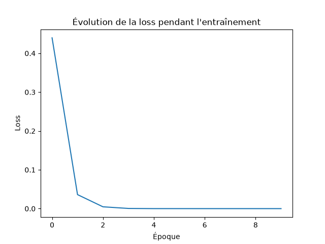

# Classificateur de sentiment PyTorch from scratch - Allociné

Classificateur binaire de sentiment (positif/négatif) sur des critiques de films en français, entraîné **from scratch** avec PyTorch sans HuggingFace, sans modèle pré-entraîné. Ce projet constitue la baseline du dépôt, avant comparaison avec une approche par [fine-tuning de CamemBERT](https://github.com/narsatGit/camembert-sentiment-allocine-2).

## Approche technique

- **Dataset** : [tblard/allocine](https://huggingface.co/datasets/tblard/allocine) (critiques de films Allociné.fr, labellisées positif/négatif)
- **Sous-ensemble utilisé** : 2000 critiques d'entraînement, 500 critiques de test (mélangées avec `seed=42` pour la reproductibilité), pour rester rapide sur CPU
- **Prétraitement** : suppression de la ponctuation (en conservant apostrophes et tirets), mise en minuscules, tokenisation par espaces
- **Vectorisation** : Bag-of-Words (comptage d'occurrences), vocabulaire de 21517 construit uniquement sur le jeu d'entraînement
- **Architecture du réseau** : Linear(vocab_size, 256) -> ReLU -> Linear(256, 32) -> ReLU -> Linear(32, 1) -> Sigmoid
- **Entraînement** : 10 époques, batch size 32, optimiseur Adam (lr=0.01), loss BCELoss

## Résultats

| Métrique | Valeur |
|---|---|
| Loss finale (train) | ~0.0000 |
| Accuracy (test, 500 exemples) | 85.80% |



## Limite connue : surapprentissage

La loss sur le jeu d'entraînement tombe à quasiment 0 dès l'époque 5, alors que l'accuracy sur le jeu de test plafonne à 85.80%. Cet écart indique que le modèle (~5,5 millions de paramètres pour la seule première couche) a en grande partie **mémorisé** les 2000 critiques d'entraînement plutôt que d'apprendre uniquement des motifs généralisables. Des pistes pour réduire ce phénomène : `Dropout`, arrêt anticipé de l'entraînement (early stopping), ou régularisation L2.

## Installation et exécution

```bash
git clone https://github.com/narsatGit/camembert-sentiment-allocine.git
cd camembert-sentiment-allocine
python -m venv venv
venv\Scripts\activate       # Windows
pip install -r requirements.txt
python src/train.py
```

## Structure du projet

```
camembert-sentiment-allocine/
├── src/
│ ├── preprocessing.py # Nettoyage, tokenisation, vocabulaire, vectorisation Bag-of-Words
│ ├── model.py # Architecture du réseau (PyTorch nn.Module)
│ └── train.py # Script principal : entraînement + évaluation
├── resultats/
│ └── courbe_loss.png
└── requirements.txt